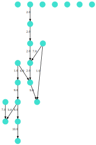
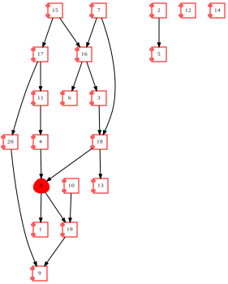
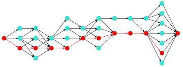

# PlotGraphviz.jl

[](https://codecov.io/gh/tragisch/PlotGraphviz.jl)


The goal of `PlotGraphviz.jl` is to unleash the power of  `Graphviz` in your IJulia environment. It is using [`ShowGraphviz.jl`](https://github.com/tkf/ShowGraphviz.jl), which derive various show methods from text/vnd.graphviz and PlotGraphviz.jl present a simple interface for all features of Graphviz (https://graphviz.org).

`PlotGraphviz.jl` takes as input graphs from [`SimpleWeightedGraphs.jl`](https://github.com/JuliaGraphs/SimpleWeightedGraphs.jl)

Currently it is still beta, and not well tested yet.

## How to use


```julia
using Pkg
Pkg.activate("../.")
using Revise

using PlotGraphviz
```


Generate some Graphs by importing `Graphs.jl` and `SimpleWeightedGraphs.jl`:


```julia
using Graphs, SimpleWeightedGraphs
```


```julia
g = SimpleWeightedGraph(3)  # or use `SimpleWeightedDiGraph` for directed graphs
SimpleWeightedGraphs.add_edge!(g, 1, 2, 0.5)
SimpleWeightedGraphs.add_edge!(g, 2, 3, 0.8)
SimpleWeightedGraphs.add_edge!(g, 1, 3, 2.0);
```

`SimpleWeightedGraphs.jl` are directly supported:


```julia
plot_graphviz(g)
```

    

    

Or use generators from `Graphs.jl`:


```julia
grid = Graphs.grid([10,5])
```


    {50, 85} undirected simple Int64 graph


```julia
plot_graphviz(SimpleWeightedGraph(grid))
```


    

    


## Plotting Options and Attributes:

First using a simple random directed graph generator:


```julia
function rand_directed_network(nodeNumber::Int, density::Float64; weights = 1:10)
    adj_matrix = zeros(nodeNumber, nodeNumber)
    for row in 1:nodeNumber
        for element in 1:nodeNumber
            if rand() < density && (element != row)
                adj_matrix[row, element] = rand(weights)
            end
        end
    end
    SimpleWeightedDiGraph(adj_matrix')
end
```


    rand_directed_network (generic function with 1 method)


```julia
mk = rand_directed_network(20,0.04)
```


    {20, 14} directed simple Int64 graph with Float64 weights


### Options:

Some usefull options are 
- *scale* to increase size of plot and 
- *edge_label* [true,false] to show the edge weights
- *node_label* [true,false] to show node_label_number
- (optional) *landscape* [true,false] for landscape representation, but labels aren't rotated as well.


```julia
plot_graphviz(mk, node_label=false, edge_label=true; scale=4)
```


    

    


### Attributes:

`Graphviz` offers an endless list of graph attributes to configure graphs representation (see https://graphviz.org/doc/info/attrs.html).

PlotGraphviz attributes list is based on https://github.com/JuliaAttic/OldGraphs.jl/blob/master/src/dot.jl. A dictionary is used to store all graph, node and edge attributes.

To simplify it, a generic attributes dictionary it generate for each graph:


```julia
attrs = get_attributes(mk)
```


    Dict{Symbol, Vector{String}} with 15 entries:
      :width       => ["N", "0.25"]
      :largenet    => ["P", "200"]
      :fixedsize   => ["N", "true"]
      :shape       => ["N", "circle"]
      :overlap     => ["G", "scale"]
      :height      => ["N", "0.25"]
      :size        => ["G", "7.0"]
      :layout      => ["G", "dot"]
      :center      => ["G", "1"]
      :arrowsize   => ["E", "0.5"]
      :color       => ["N", "Turquoise"]
      :weights     => ["P", "false"]
      :fontsize    => ["E", "1.0"]
      :arrowtype   => ["E", "normal"]
      :concentrate => ["G", "true"]


The *:symbol* belongs to the graphviz' attributes and "G","N", "E" to graph-, node- and edge-attribute. 

For example, to change node color to red:


```julia
attrs[:color] = ["N", "Red"]; # red node-color
attrs[:shape] = ["N", "component"]; # change node shape to component
```


```julia
plot_graphviz(mk, attrs)
```


    

    


## Import/Export Dot-Files

To Import Dot-files a simple Reader is available:


```julia
g = read_dot_file("../test/data/large_dag.dot")
```


    {515, 11929} directed simple Int64 graph with Float64 weights


```julia
plot_graphviz(g; scale=7)
```


    

    


To export in dot-file format:


```julia
write_dot_file(mk,"../test/data/mk_rnd_graph.dot", attributes=attrs);
```

## Color graph:


```julia
plot_graphviz(mk, attrs)
```


    

    


We can mark a *path* or *components* in a graph by color. There are two shortcuts:

#### Connected Components:

Use Graphs algorithm to indentify connected components:


```julia
L = Graphs.connected_components(mk)
```


    7-element Vector{Vector{Int64}}:
     [1]
     [2, 4, 5, 6, 7, 8, 10, 11, 12, 15, 16, 17, 18, 20]
     [3]
     [9]
     [13]
     [14]
     [19]


Transform it to a vector for which each number represents the color of node:


```julia
color_vec = zeros(Int, 1, nv(mk))
color = 1
for components in L
    for idx in components
        color_vec[idx] = color
    end
    color = color + 1
end
```


```julia
plot_graphviz(mk, attrs; colors = color_vec)
```


    

    


### Shortest path:

Import a small layered dag:


```julia
lydag = read_dot_file("../test/data/small_layered_dag.dot") 
```


    {34, 61} directed simple Int64 graph with Float64 weights


```julia
plot_graphviz(lydag, node_label = false; landscape = true, scale = 5)
```


    

    


To get the shortest path, we use Graphs.jl:


```julia
path = Graphs.dijkstra_shortest_paths(lydag, nv(lydag));
```


```julia
# convert precedessor list in path:
spath(ds, source, sink) = source == sink ? source : [spath(ds, ds.parents[source], sink) source];
```

And evaluate shortest path between **super-sink** and **super-source**:


```julia
L= spath(path, 1, nv(lydag))
```


    1×12 Matrix{Int64}:
     34  33  25  24  21  20  15  11  10  8  2  1


Represent shortest path in graph:


```julia
plot_graphviz(lydag, node_label = false; landscape = true, scale = 5, path = L)
```


    

    


```julia

```
