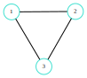
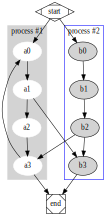
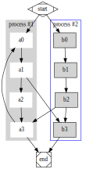
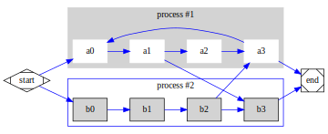
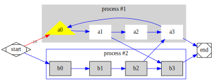
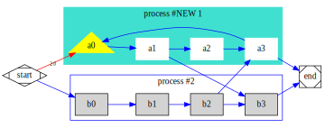
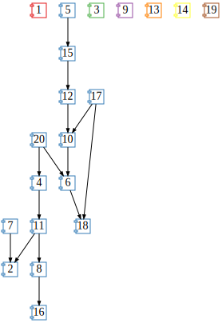
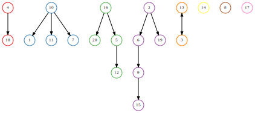
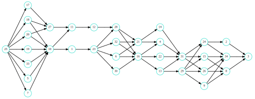
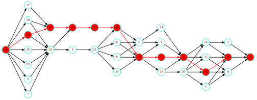

# PlotGraphviz.jl

- `PlotGraphviz.jl` tries to unleash the power of **Graphviz** in your IJulia environment. It is using [`ShowGraphviz.jl`](https://github.com/tkf/ShowGraphviz.jl), which derive various show methods from text/vnd.graphviz (https://graphviz.org). To parse dot files it uses [`ParserCombinator.jl`](https://github.com/andrewcooke/ParserCombinator.jl/blob/master/src/dot/DOT.jl).

- `PlotGraphviz.jl` presents a simple interface for (nearly) all features of Graphviz. 

- `PlotGraphviz.jl` accepts graphs from [`SimpleWeightedGraphs.jl`](https://github.com/JuliaGraphs/SimpleWeightedGraphs.jl)

## How to use it

Generate some Graphs by importing `Graphs.jl` and `SimpleWeightedGraphs.jl`:

```julia
using Graphs, SimpleWeightedGraphs
```


```julia
using PlotGraphviz
```

and use `SimpleWeightedGraphs.jl` to generate a simple graph:


```julia
g = SimpleWeightedGraph(3)  # or use `SimpleWeightedDiGraph` for directed graphs
SimpleWeightedGraphs.add_edge!(g, 1, 2, 0.5)
SimpleWeightedGraphs.add_edge!(g, 2, 3, 0.8)
SimpleWeightedGraphs.add_edge!(g, 1, 3, 2.0);
```


```julia
plot_graphviz(g)
```


    

    


Or use generators from `Graphs.jl`, i.e.:


```julia
grid = Graphs.grid([10,5])
```


    {50, 85} undirected simple Int64 graph


```julia
plot_graphviz(SimpleWeightedGraph(grid))
```


    

    


## Importing and modifying graphs

First, let us import a standard example, and use the function `read_dot_file` (more with `?` function) to import the graph from a dot-file.


```julia
mk, attrs = read_dot_file("./test/data/directed/clust4.gv");
```


```julia
plot_graphviz(mk, attrs)
```


    

    


The value $attrs$ is a struct, that stores the GraphvizAttributes of the imported graph (as it is defined in "*.dot" file itself)

There are mainly 3 different Graph options available in Graphviz (see website for more):
- graph_options: attributes/properties, which belongs to the complete graph (i.e. rankdir, label, ...)
- node_options: attributes/properties to modify all nodes at once
- edge_options: attributes/properties to modify all edges at once

As an example we would like to modify the shape of all nodes. Therefore we use the `set!` function. As we would like to modify the nodes, we have to use the node_options of our struct:


```julia
set!(attrs.node_options, Property("shape","box"));
plot_graphviz(mk, attrs)
```


    

    


Next we change the orientation of our graph by modifying its graph_options and additionally we change the edge color (using edge_options):


```julia
set!(attrs.graph_options, Property("rankdir","LR"));
set!(attrs.edge_options, Property("color","blue"));
plot_graphviz(mk, attrs; scale = 5)
```


    

    


To modify a single node, we need to access the node by its $name (String)$ or its $id (Int)$:


```julia
set!(attrs.nodes, "a0", Property("shape","triangle"))
set!(attrs.nodes, "a0", Property("filled","true"))
set!(attrs.nodes, "a0", Property("color","yellow"))
plot_graphviz(mk, attrs; scale = 5)
```


    

    


To access a single edge, we have to know its unique $id (Int)$. We can use `get_id` to return the id from a node with a given name.


```julia
id_a0 = get_id(attrs.nodes,"start");
id_a1 = get_id(attrs.nodes,"a0");

set!(attrs.edges,id_a0, id_a1, Property("color","red"))
set!(attrs.edges,id_a0, id_a1, Property("xlabel","2.0"))
set!(attrs.edges,id_a0, id_a1, Property("fontsize","8.0"))
plot_graphviz(mk, attrs; scale = 5)
```


    

    


The imported graph $mk, attrs$ consists of two subgraphs (of type cluster - see Graphviz). To get access to their attributes we need to change the cluster itself. 


```julia
set!(attrs.subgraphs[1].graph_options, Property("color","Turquoise"));
set!(attrs.subgraphs[1].graph_options, Property("label","process #NEW 1"));
plot_graphviz(mk, attrs; scale = 5)
```


    

    


But it is not possible to access a node or edge inside a cluster. Therefore we can use a built-in trick to manipulate the node directly:


```julia
set!(attrs.subgraphs[2].nodes, "b0", Property("color","green")); ## does not work inside a cluster!
set!(attrs.nodes, "b0", Property("color","green")); ## but this works!
plot_graphviz(mk, attrs; scale = 5)
```


    

    


To write and store the graph use the `write_dot_file` function:


```julia
write_dot_file(mk,"./test.dot"; attributes=attrs);
```

## Default Attributes:

Back to our graph $g$. How to get the Graphviz attributes of this graph? Well, there are two ways:
1. call an empty constuctor: attrs = GraphivzAttributes()
2. call the contructor with our graph $g$: attrs = GraphivzAttributes(g::AbstractSimpleWeightedGraph)

The second call generates the default plotting parameter, which ist used to represent the graph using `plot_graphviz()`.


```julia
attrs = GraphvizAttributes(g)
```


    GraphvizAttributes(Property[Property{String}("weights", "false"), Property{String}("largenet", "200")], Property[Property{String}("center", "\"1,1\""), Property{String}("overlap", "scale"), Property{String}("concentrate", "true"), Property{String}("layout", "neato"), Property{String}("size", "3.0")], Property[Property{String}("color", "Turquoise"), Property{String}("fontsize", "7.0"), Property{String}("width", "0.25"), Property{String}("height", "0.25"), Property{String}("fixedsize", "true"), Property{String}("shape", "circle")], Property[Property{String}("arrowsize", "0.5"), Property{String}("arrowtype", "normal"), Property{String}("fontsize", "1.0")], PlotGraphviz.gvSubGraph[], gvNode[gvNode(1, "1", Property[]), gvNode(2, "2", Property[]), gvNode(3, "3", Property[])], gvEdge[gvEdge(1, 2, Property[Property{Float64}("xlabel", 0.5)]), gvEdge(1, 3, Property[Property{Float64}("xlabel", 2.0)]), gvEdge(2, 1, Property[Property{Float64}("xlabel", 0.5)]), gvEdge(2, 3, Property[Property{Float64}("xlabel", 0.8)]), gvEdge(3, 1, Property[Property{Float64}("xlabel", 2.0)]), gvEdge(3, 2, Property[Property{Float64}("xlabel", 0.8)])])


## Color and Path:

There a two special functions available.

### Color the graph:

One typical problem in graph theory is to identity connected components and to color them:


```julia
g2,attrs2 = read_dot_file("./test/data/example.dot");
```


```julia
plot_graphviz(g2; edge_label=true, scale=6)
```


    

    


Use Graphs algorithm to indentify connected components:


```julia
L = Graphs.connected_components(g2)
```


    8-element Vector{Vector{Int64}}:
     [1, 19]
     [2, 7, 13, 16]
     [3, 4, 9, 11]
     [5, 6, 10, 17, 18]
     [8, 20]
     [12]
     [14]
     [15]


Transform it to a vector for which each number represents the color of node:


```julia
color_vec = zeros(Int, 1, nv(g2))
color = 1
for components in L
    for idx in components
        color_vec[idx] = color
    end
    color = color + 1
end
```


```julia
plot_graphviz(g2, attrs2; colors = color_vec, scale = 7)
```


    

    


### Shortest path:

Import a small layered dag:


```julia
lydag, attrs = read_dot_file("./test/data/small_layered_dag.dot");
```


```julia
plot_graphviz(lydag; landscape = true, scale = 7)
```


    

    


To get the shortest path, we use Graphs.jl:


```julia
path = Graphs.dijkstra_shortest_paths(lydag, 3);
```


```julia
# convert precedessor list in path:
spath(ds, source, sink) = source == sink ? source : [spath(ds, ds.parents[source], sink) source];
```

And evaluate shortest path between **super-sink** and **super-source**:


```julia
L= spath(path, 25, 3)
```


    1×12 Matrix{Int64}:
     3  34  26  31  22  16  28  12  11  27  20  25


Represent shortest path in graph:


```julia
plot_graphviz(lydag; landscape = true, scale = 7, path = L)
```


    

    


## Comments

Open issues
- Not all test graphs are imported correcty.
- Performance issues has to be solved
- Design Patterns and Best Practices to be implemented.


